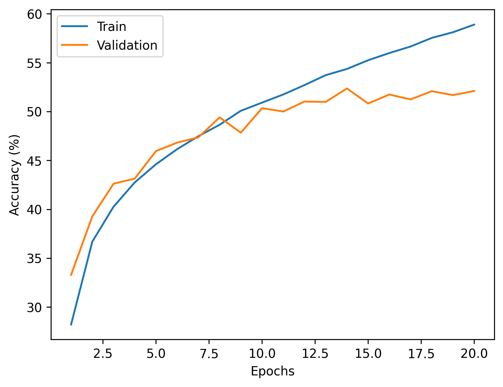
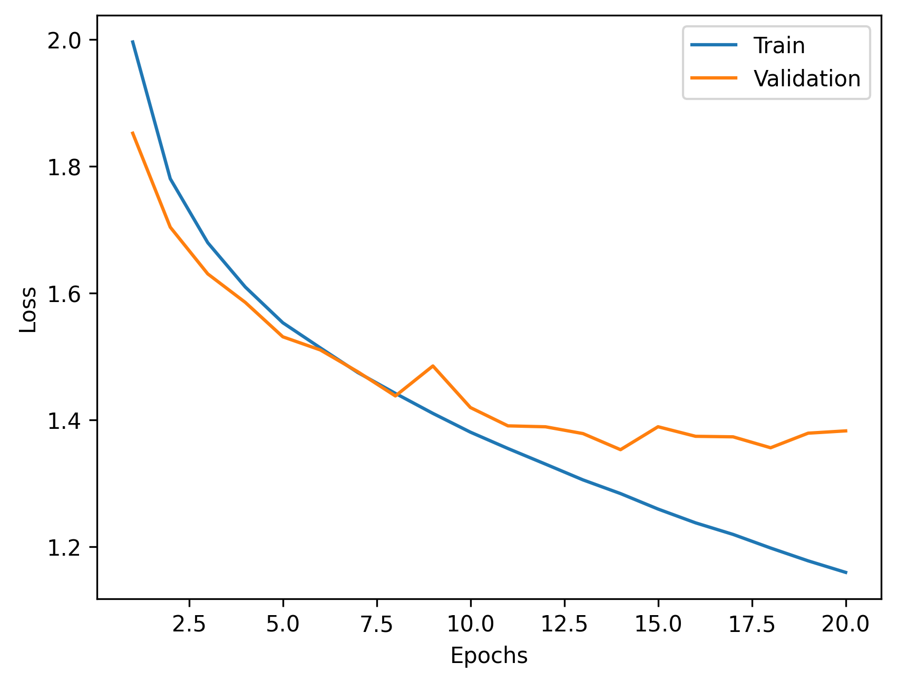

# CIFAR-10 Image Classification with PyTorch

A small deep learning project built from scratch to understand the complete
image classification pipeline using PyTorch.

## Goal

The goal of this project is to build and compare neural network architectures
for CIFAR-10 image classification while learning:

- Data preprocessing
- Train/validation/test splitting
- PyTorch DataLoader
- Training and evaluation loops
- Loss and accuracy tracking
- Overfitting analysis
- MLP vs CNN architectures

## Dataset

CIFAR-10 contains 60,000 RGB images of size 32x32 from 10 classes.

- Training: 45,000 images
- Validation: 5,000 images
- Test: 10,000 images

## Experiments

### MLP Baseline

Architecture:

3072 → 1024 → 512 → 10

Training configuration:

- Optimizer: SGD
- Learning rate: 0.01
- Epochs: 20
- Loss: CrossEntropyLoss

Results:

- Test Accuracy: 53.6%

## Project Structure

```text
cifar10-pytorch/
├── notebooks/
│   └── experiment.ipynb
├── src/
│   └── model.py
├── results/
├── README.md
├── requirements.txt
└── .gitignore

### Accuracy



### Loss

